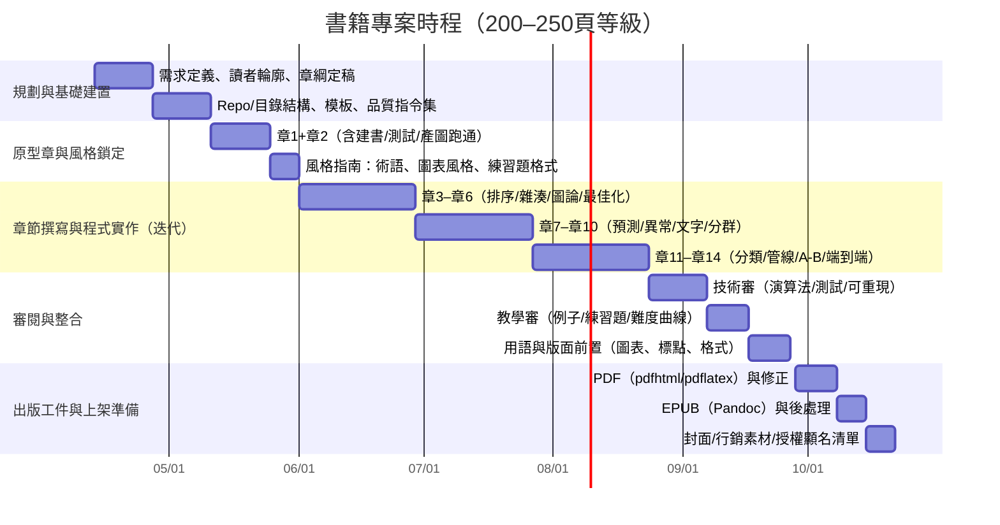

# 以 Codex 協作撰寫《日常與職場的演算法應用》之專案藍圖、章節設計與出版規格

## 執行摘要

- 本報告提出一個「可直接落地」的書籍專案結構：以單一頂層工作目錄管理章節內容、程式範例、資料集、圖片與圖表、練習題、單元測試、以及出版資產（PDF/EPUB、封面、版面與行銷素材），並提供一致的命名規範與檔案格式建議。  
- 以 Codex 作為協作核心（能讀取、修改並執行專案目錄中的程式碼，並建議在每次任務前後用 Git checkpoints 方便回復），形成「寫作—產碼—測試—修訂—出書」閉環。citeturn5search4turn5search2  
- 出版管線建議以 Jupyter Book（支援以 `_toc.yml`、`_config.yml` 組織內容並可輸出 PDF）為主，並以 Pandoc 補足 EPUB 產出與格式轉換彈性。citeturn4search4turn4search0turn4search2turn4search6  
- 章節規劃提供 14 章（符合「12–16 章」要求），每章以「日常/職場情境 → 演算法思路 → Python（預設）實作 → 測試與練習 → 圖表/圖解」為固定節奏；總頁數配置建議：正文章節約 212 頁，搭配前言/附錄/索引等可達 200–250 頁目標。  
- 資料集策略採「可重現、可授權、可自動生成」：優先使用自建合成資料與可公開授權的資料來源；若使用臺灣政府開放資料，需遵守「顯名聲明」等義務。citeturn0search2turn0search14  

## 專案工作目錄與產出規格

### 頂層工作目錄名稱與總體原則

- 頂層工作目錄（Top-level working directory）建議  
  - `algo-in-life-work-book/`  
- 設計原則（建議）  
  - 「內容（書稿）」與「程式（可執行）」分離：書稿在 `book/`，可執行範例在 `code/`，可測試邏輯可下沉至 `src/`。  
  - 資料分層：`data/raw`（原始）、`data/processed`（處理後）、`data/synthetic`（合成資料），並以腳本可重建。  
  - 每個資料夾都有自己的 `README.md`：同一套章法（目的、輸入輸出、命名規則、如何新增、如何驗證）。  
  - 任何可被自動化的事情，優先以指令/腳本固化（測試、建書、匯出、產圖），讓 Codex 能在專案內反覆可靠地執行。citeturn5search6turn5search9  

### 命名慣例與檔案格式

- 目錄命名（建議）  
  - 一律 `kebab-case`：例如 `chapter-assets/`、`ch04-graphs-and-routing/`  
- Python 模組與檔名（建議）  
  - 一律 `snake_case.py`，測試以 `test_*.py` 對應。  
- 章節編號（建議）  
  - 章節資料夾：`ch01-...` 到 `ch14-...`（固定兩位數），保持可排序與可擴充。  
- 文字與出版  
  - 書稿主要格式：MyST Markdown（`.md`）與（必要時）Jupyter Notebook（`.ipynb`）。Jupyter Book 以 `_toc.yml`、`_config.yml` 管理結構與設定。citeturn4search4turn4search24  
  - PDF：由 Jupyter Book 輸出（`--builder pdfhtml` 或 `--builder pdflatex`）。citeturn4search0turn4search12  
  - EPUB：由 Pandoc 產出（Pandoc 原生支援 EPUB）。citeturn4search6turn4search2  
- 表格與資料  
  - CSV：適合與試算表互通（Python `csv` 標準庫支援讀寫）。citeturn7search6  
  - Parquet：適合處理後資料與加速讀寫（`pandas.read_parquet`、`DataFrame.to_parquet` 提供 I/O）。citeturn1search2turn1search6turn1search10  
  - NumPy 二進位：`.npy`（單陣列）、`.npz`（多陣列封裝），並注意 `numpy.load` 對 pickle 的安全警示（建議預設 `allow_pickle=False`）。citeturn1search9turn1search1turn1search17  
- 圖表與圖解  
  - 靜態圖：優先向量 `SVG/PDF`（印刷友善），必要時用 `PNG`（螢幕預覽）；Matplotlib `savefig` 支援多種輸出格式。citeturn1search3turn1search15  
  - 流程圖/甘特圖：Mermaid（可渲染 Gantt 並可輸出 SVG/PNG）。citeturn4search3turn4search15  
  - 版面示意：建議保留可編輯來源（例如 `.drawio`、`.fig`、`.svg`）與輸出檔（`.svg`/`.png`）。  

### 建議的專案目錄結構

```mermaid
flowchart TD
  A["algo-in-life-work-book/"] --> B["README.md (總覽/快速開始)"]
  A --> C["book/ (Jupyter Book 內容與輸出設定)"]
  C --> C1["_config.yml"]
  C --> C2["_toc.yml"]
  C --> C3["index.md (首頁/導讀)"]
  C --> C4["preface.md (前言)"]
  C --> C5["chapters/"]
  C5 --> CH1["ch01-algorithmic-thinking/"]
  CH1 --> CH1a["index.md (章內容)"]
  CH1 --> CH1b["exercises.md (練習)"]
  CH1 --> CH1c["figures/ (章內圖)"]
  C5 --> CHX["... ch14-capstone/ (同構)"]
  C --> C6["shared-assets/ (全書共用圖/樣式)"]
  C6 --> C6a["images/"]
  C6 --> C6b["styles/ (CSS/LaTeX header)"]
  A --> D["code/ (可執行範例程式入口)"]
  D --> D0["README.md"]
  D --> D1["common/ (共用工具)"]
  D --> D2["ch01/ ... ch14/ (章別範例)"]
  A --> E["src/ (可測試/可重用的核心實作)"]
  E --> E1["algo_in_life/ (Python package)"]
  E1 --> E1a["__init__.py"]
  E1 --> E1b["algorithms/"]
  E1 --> E1c["pipelines/"]
  A --> F["data/ (資料資產)"]
  F --> F0["README.md (來源/授權/再現方式)"]
  F --> F1["raw/"]
  F --> F2["processed/"]
  F --> F3["synthetic/"]
  F --> F4["external/ (第三方下載快照; 需授權)"]
  A --> G["tests/ (pytest)"]
  G --> G0["README.md"]
  G --> G1["test_ch01_*.py ..."]
  A --> H["scripts/ (下載/清理/建書/產圖)"]
  H --> H1["build_book.sh"]
  H --> H2["export_epub.sh"]
  H --> H3["make_synthetic_data.py"]
  A --> I["publication/ (出版資產)"]
  I --> I1["cover/ (封面原檔/輸出)"]
  I --> I2["layout/ (版面/字型/樣式)"]
  I --> I3["marketing/ (文案/圖卡)"]
  I --> I4["outputs/ (pdf/epub/html; 可不入版控)"]
  A --> J[".codex/ (專案級 Codex 設定/技能)"]
  J --> J1["config.toml"]
  J --> J2["skills/ (可選)"]
  A --> K["pyproject.toml (依賴/工具設定)"]
  A --> L["LICENSE (授權)"]
  A --> M["CITATION.cff (可選: 引用資訊)"]
  A --> N[".github/workflows/ (CI: 測試/建書)"]
```



- 補充：Codex 設定檔建議採「使用者層級 `~/.codex/config.toml` + 專案層級 `.codex/config.toml`」分層，以便在某書專案中鎖定模型、核准模式、與可執行指令範圍。citeturn5search22turn5search27  

### 各資料夾 README 建議內容

| 資料夾 | 主要用途 | 建議 README 必含段落（建議） | 典型檔案/格式 |
|---|---|---|---|
| `book/` | 書稿主體、目錄結構、建置設定 | - 建書指令（HTML/PDF）<br>- `_toc.yml` 編排規則<br>- 章節新增方式與檔名規則<br>- 圖片與資產引用方式 | `_config.yml`、`_toc.yml`、`.md`、`.ipynb` citeturn4search4turn4search0turn4search36 |
| `book/chapters/` | 章節內容、章內練習與圖 | - 章節固定模板（學習目標/範例/練習/測試）<br>- 章內圖檔命名規則（`fig_chXX_*`）<br>- 與 `code/chXX` 對照規則 | `index.md`、`exercises.md`、`figures/*.svg` |
| `book/shared-assets/` | 全書共用圖片/樣式 | - 共用資產引用方式<br>-樣式修改流程與輸出規則 | `images/`、`styles/` |
| `code/` | 讓讀者「一鍵跑起來」的章別範例入口 | - 每章如何執行（命令列）<br>- 範例輸入/輸出約定<br>- 資料依賴（`data/`）與產圖位置 | `.py`、`.ipynb` |
| `src/` | 可重用、可單元測試的核心實作 | - 目標：可組裝、可測試、可被多章引用<br>- 模組邊界與依賴規範 | Python package 結構 |
| `data/` | 資料來源、快照、合成資料 | - 資料來源與授權<br>- 下載/生成腳本位置<br>- 目錄分層定義（raw/processed/synthetic）<br>- 顯名/引用格式 | `.csv`、`.parquet`、`.npz` citeturn7search6turn1search6turn1search1turn0search2 |
| `tests/` | 驗證演算法與範例輸出一致性 | - 如何跑 pytest<br>- 測試命名與章別對照<br>- fixtures/參數化策略 | `test_*.py`（pytest）citeturn1search0turn1search20 |
| `scripts/` | 自動化（建書、產圖、資料生成） | - 指令列表與用途<br>- 重要輸出位置（publication/outputs）<br>- 失敗排查（常見錯誤） | `.sh`、`.py` |
| `publication/` | 封面、版面、輸出、行銷素材 | - 產出規格（PDF/EPUB）<br>- 匯出指令與版本命名<br>- 封面/圖卡授權與素材來源記錄 | PDF/EPUB/PNG/SVG citeturn4search0turn4search6turn4search2 |
| `.codex/` | Codex 專案級設定、技能（可選） | - 設定差異（專案 vs 使用者）<br>- 允許執行的品質指令集合（lint/test/build） | `config.toml` citeturn5search22turn5search9 |

## 章節規劃與對照表

### 章節設計共通骨架

- 每章結構（建議）  
  - 情境故事（1–2 頁）→ 問題抽象化（資料/目標/限制）→ 演算法直覺與步驟 → Python 範例（可執行）→ 單元測試（可重現）→ 練習題（含延伸）→ 圖解/小結  
- 主要工具鏈（本書範例預設）  
  - 資料處理與格式：pandas（CSV/Parquet I/O）、NumPy（`.npy/.npz`）。citeturn1search10turn1search6turn1search1turn1search17  
  - 視覺化：Matplotlib（支援 `png/pdf/svg` 輸出）。citeturn1search3turn1search15  
  - 機器學習/文字：scikit-learn（TF‑IDF、cosine similarity、KMeans、Pipeline、IsolationForest、Scaler 等）。citeturn2search0turn2search1turn0search9turn3search3turn0search5turn3search6  
  - 圖論：NetworkX（最短路徑含 Dijkstra）。citeturn2search2turn2search6  
  - 最佳化：OR‑Tools（CP‑SAT）與/或 SciPy `linprog`（線性規劃）。citeturn2search7turn8search3  
  - 統計與時間序列：statsmodels（ARIMA、ExponentialSmoothing、t 檢定、比例 z 檢定）。citeturn3search0turn3search1turn8search0turn8search1  

### 章節對照表（14 章）

| 章節資料夾名稱 | 章名 | 章節摘要（繁中，1–2 段） | 核心演算法（建議涵蓋） | 真實情境案例（例） | 範例 Codex/AI 協作程式片段（預設 Python） | 需要資料集/合成資料（描述） | 估計頁數 | 難度 |
|---|---|---|---|---|---|---|---:|---|
| `ch01-algorithmic-thinking` | 用演算法思維整理日常工作 | 本章建立全書語言：把「抱怨很花時間」改寫成「輸入/輸出/限制/成本」，讓讀者在日常瑣事中先學會抽象化。透過「待辦清單、郵件回覆、檔案整理」等情境，示範如何把問題拆成可測量的小步驟，並用簡單的計時與對照來辨識瓶頸。<br><br>同時引入「可重現」的工作方式：每個章節的程式都能被執行、被測試、被版本控制；這個節奏將在後續章節反覆出現，形成可被 Codex 自動化的固定流程。citeturn5search2turn5search9 | 抽象化、分解、成本估算（Big‑O 作為直覺）、基準測試（概念） | - 每日待辦排序與切片<br>- 回覆信件模板化流程 | `# Codex 任務：在 code/ch01 建一個 time_log 工具，含 cli、測試、README`<br>`python -m code.ch01.time_log --help` | 合成資料：一週時間紀錄（工作項目、耗時、優先度），由 `scripts/make_synthetic_data.py` 生成 | 14 | Beginner |
| `ch02-data-formats-and-tables` | 資料格式與表格：從 CSV 到 Parquet 與 NumPy 檔 | 本章聚焦「資料是演算法的燃料」，先處理最常見的 I/O 痛點：Excel/CSV、欄位型別不一致、日期格式、缺值、重複列。以 Python `csv` 與 pandas I/O 做出「同一份資料，多種格式」的可重現匯入/匯出流程。citeturn7search6turn1search10<br><br>進一步引入 Parquet（處理後資料）、`.npy/.npz`（陣列快照）作為「速度/容量/可重建」的取捨選項，並提醒 `numpy.load` 對 pickle 的安全警示，建立後續章節的資料安全基本功。citeturn1search6turn1search1turn1search17 | 缺值處理（策略）、去重、型別正規化（策略）、資料快照 | - 薪資/支出表整理<br>- 客戶名單欄位清理 | `import pandas as pd`<br>`df = pd.read_csv("data/raw/spend.csv")`<br>`df.to_parquet("data/processed/spend.parquet")`citeturn1search14turn1search6 | - 以合成支出資料為主<br>- 可選：政府開放資料 CSV（需記錄授權與顯名）citeturn0search2 | 16 | Beginner |
| `ch03-sorting-and-searching` | 排序與搜尋：把「找不到」變成可解的問題 | 本章以「通訊錄、資料夾、商品清單」示範排序與搜尋的核心價值：先定義比較規則與鍵，再選擇合適的搜尋策略（線性/二分/索引）。重點不在背公式，而在建立「資料先整理，演算法才有效」的順序感。<br><br>章末以「需求變更」作為練習：新增欄位/改排序鍵/改查詢條件，要求讀者用測試守住行為，讓後續由 Codex 產碼時也能快速驗證是否破壞既有結果。citeturn1search0 | 排序（穩定/鍵）、二分搜尋、區間查詢（概念） | - 商品比價清單排序<br>- 會議記錄快速定位 | `# Codex：幫我把排序鍵改為 (priority desc, date asc)，並補 pytest 參數化`citeturn1search0 | 合成資料：1000 筆清單（日期/優先度/標籤），並提供「已排序快照」用於回歸測試 | 14 | Beginner |
| `ch04-hashing-and-dedup` | 雜湊與去重：檔案、資料列、內容指紋 | 本章用「照片重複、附件重複、資料列重複」貫穿雜湊（hash）的用途：用固定長度指紋做快速比對。以 Python `hashlib` 示範 SHA‑256 雜湊流程，並以 `filecmp`/`difflib` 補上「內容差異」檢視，形成從「快速篩」到「精確比」的兩段式流程。citeturn7search4turn0search31turn7search1<br><br>章內強調實務約束：雜湊用於去重與快取很常見，但在安全場景需理解演算法選擇與風險範圍；本書以「工作流程」與「資料治理」角度呈現，不做攻防細節展開。citeturn7search0 | Hashing、集合去重、內容比對（diff） | - 照片庫去重<br>- 報表版本差異檢查 | `import hashlib, pathlib`<br>`h = hashlib.sha256(path.read_bytes()).hexdigest()`citeturn7search4 | - 合成：重複檔名/內容混雜的目錄樹<br>- 章內提供可生成的假檔案腳本 | 16 | Beginner–Intermediate |
| `ch05-graphs-and-routing` | 圖論與路徑：從通勤到流程依賴 | 本章把「地圖」與「流程」統一成圖（graph）：節點是地點/任務，邊是通行/依賴。使用 NetworkX 示範最短路徑 API，並引出 Dijkstra 適用於非負權重成本的條件（例如時間、距離、費用）。citeturn2search2turn2search6<br><br>延伸到職場常見的依賴圖：資料處理管線、任務前後關係、里程碑阻塞；讀者將學會用圖結構找出「關鍵路徑」與「瓶頸節點」，並把這些輸出回寫為章內的圖表與練習。 | Dijkstra、BFS（概念）、依賴圖（概念） | - 通勤/外送路線估算<br>- 專案任務依賴視覺化 | `import networkx as nx`<br>`path = nx.shortest_path(G, "A", "B", weight="cost", method="dijkstra")`citeturn2search14 | 合成資料：10–200 節點的加權圖（CSV 邊表：from,to,cost），並提供產圖腳本 | 16 | Intermediate |
| `ch06-optimization-scheduling` | 排程與最佳化：把「差不多」變成「可證明更好」 | 本章從「排班、會議室、任務分派」切入最佳化建模：先把需求寫成目標函數與限制式，再交給求解器。以 OR‑Tools CP‑SAT 為主要示範（適合整數規劃/排程），並示範求解狀態（OPTIMAL/FEASIBLE 等）如何影響決策。citeturn2search3turn2search7<br><br>同章提供「較輕量」替代路線：若問題可線性化，SciPy `linprog` 可解線性規劃，便於快速驗證與教學。讀者將理解「模型假設」比「求解器參數」更重要，並用測試固定住可接受的輸出範圍。citeturn8search3turn2search19 | 約束規劃（CP‑SAT）、整數規劃（概念）、線性規劃（linprog） | - 員工排班<br>- 任務分派（人×任務） | `# OR-Tools：建立 CP-SAT 變數與限制`<br>`# SciPy：linprog(c, A_ub, b_ub, ...)`citeturn2search7turn8search3 | 合成資料：員工可用時段、技能矩陣、任務工時；可選：以公開資料做「資源限制」情境 | 18 | Intermediate |
| `ch07-time-series-forecasting` | 時間序列預測：從採購到工作量估算 | 本章用「每週需求量、網站流量、出貨量」建立預測直覺：先用移動平均做基線，再引入指數平滑（Holt‑Winters）與 ARIMA 作為結構化模型選項。以 statsmodels 的 ExponentialSmoothing 與 ARIMA 作為主例，讓讀者可直接跑出 forecast。citeturn3search1turn3search0turn3search16<br><br>同時強調資料頻率與切分：預測不是追求「神準」，而是用一致的評估方法持續改進；章內練習會要求讀者把同一套流程寫進可重現腳本，並用固定時間窗做回測。 | 移動平均、指數平滑、ARIMA/SARIMA（概念與 API） | - 少量庫存補貨<br>- 人力需求估算 | `from statsmodels.tsa.holtwinters import ExponentialSmoothing`<br>`model = ExponentialSmoothing(y, trend="add", seasonal="add", seasonal_periods=7).fit()`citeturn3search1turn3search5 | - 合成：含趨勢/季節性的日資料<br>- 可選：政府開放資料時間序列（需顯名）citeturn0search2 | 16 | Intermediate |
| `ch08-anomaly-detection` | 異常偵測：找出「不太對勁」的訊號 | 本章以「費用報帳、設備感測、登入紀錄」示範異常偵測的兩類需求：規則式（z‑score/分位數）與模型式（Isolation Forest 等）。IsolationForest 的直覺是「異常點更容易被隨機切分隔離」，並可用 scikit‑learn 直接實作。citeturn0search5turn0search1<br><br>章末以比較觀點收束：不同資料分布下各算法敏感度不同，因此本章會要求讀者用同一套資料生成器跑多組情境，再用圖表呈現誤報/漏報的取捨，建立「可討論」的監控指標。citeturn0search29 | z‑score（概念）、Isolation Forest、LOF（概念） | - 報帳異常<br>- 伺服器延遲尖峰 | `from sklearn.ensemble import IsolationForest`<br>`clf = IsolationForest(random_state=0).fit(X)`citeturn0search5 | 合成資料：常態群 + 少量外點（可調比例），並輸出可視化用座標 | 14 | Intermediate |
| `ch09-text-similarity-search` | 文字相似度與搜尋：筆記、FAQ、知識庫 | 本章把「找資料」具體化：先把文字轉成特徵，再計算相似度。以 TF‑IDF 作為可解釋的起點（TfidfVectorizer 可把文件轉成 TF‑IDF 矩陣），再以 cosine similarity 做相似度排序。citeturn2search0turn2search1turn2search13<br><br>加入 scikit‑learn Pipeline 的理由是把「前處理 + 向量化 + 模型」固定成一條可重現管線；章內會把公司常見的 FAQ/客服回覆/會議記錄做成小型搜尋工具，並要求用測試確保同一查詢的 top‑k 结果可控。citeturn3search3turn3search11 | TF‑IDF、cosine similarity、（可選）倒排索引（概念）、Pipeline | - 內部知識庫檢索<br>- 文件去重與聚類前置處理 | `from sklearn.feature_extraction.text import TfidfVectorizer`<br>`X = TfidfVectorizer().fit_transform(docs)`<br>`scores = cosine_similarity(X[q], X).ravel()`citeturn2search0turn2search1 | 合成資料：50–500 篇短文（可混入同義改寫），或使用可公開授權文字（需記錄來源） | 18 | Intermediate |
| `ch10-clustering-segmentation` | 分群與區隔：把「一團人」切成「可行動的族群」 | 本章以「消費者/員工/內容」分群作為主線：當沒有標籤（label）時，先用分群找到結構，再回到業務語言命名群組。KMeans 的特性是快但可能落在局部最佳，因此會示範多次初始化與如何解讀結果穩定性。citeturn0search9<br><br>章末討論「分群不是答案」：輸出的群標籤需要用可視化與指標（如群內距離）搭配領域知識驗證。練習題會要求讀者在不同尺度與不同特徵集合下比較分群差異，建立「選特徵比調參重要」的實作直覺。 | KMeans、特徵縮放（概念）、群組解釋（策略） | - 客戶分級<br>- 內容主題聚類 | `from sklearn.cluster import KMeans`<br>`km = KMeans(n_clusters=5, random_state=0).fit(X)`citeturn0search9 | 合成資料：多團高斯/不同半徑；可選：把支出資料特徵化後分群 | 14 | Intermediate |
| `ch11-classification-and-evaluation` | 分類與評估：把規則升級成可檢驗的模型 | 本章用「是否會延遲、是否會流失、是否為高風險」等二元分類情境，示範從 baseline（規則/閾值）到簡單模型（kNN/線性模型）再到評估。以最近鄰分類示範決策邊界直覺（KNeighborsClassifier 範例可直接參照）。citeturn0search17<br><br>評估指標以「可溝通」為優先：先從 accuracy 進入，再延伸到更適合不均衡資料的指標（如 average precision 的概念與 API）。citeturn2search29turn2search37 | kNN（概念/示例）、資料切分（策略）、accuracy/PR 指標 | - 交付延誤預警<br>- 工單優先度分類 | `from sklearn.neighbors import KNeighborsClassifier`<br>`clf = KNeighborsClassifier(n_neighbors=7).fit(X_train, y_train)`citeturn0search17 | 合成資料：帶噪聲的二類資料；可選：以公司流程資料做特徵（需去識別） | 14 | Intermediate |
| `ch12-preprocessing-and-pipelines` | 前處理與管線：避免資料外洩，讓流程可重現 | 本章專談「最常見、也最容易被忽略」的錯誤：把 scaler/特徵轉換在切分訓練/測試前就套用，產生資料外洩。scikit‑learn 文件明確建議把 StandardScaler 放進 Pipeline 以降低外洩風險；本章會將其變成可操作的章內規範。citeturn3search33turn3search11<br><br>同時示範 MinMaxScaler 與 StandardScaler 的差異與公式直覺，並用「一件事一個 Pipeline」的寫法，使 Codex 能在新增步驟時維持一致結構（也便於自動補測試）。citeturn3search2turn3search6turn3search3 | StandardScaler、MinMaxScaler、Pipeline、資料外洩（概念） | - 模型前處理模板化<br>- 多專案共用特徵流程 | `from sklearn.pipeline import make_pipeline`<br>`pipe = make_pipeline(StandardScaler(), clf)`citeturn3search15turn3search33 | 使用前章資料：分類/分群特徵矩陣；另提供「外洩版 vs 正確版」對照資料切分腳本 | 14 | Intermediate |
| `ch13-experimentation-ab-testing` | 實驗與 A/B 測試：用統計檢定支撐決策 | 本章以「改版是否提升轉換率」為例，建立 A/B 測試的資料結構（曝光、點擊/轉換、分組）與常見誤區（樣本不足、重複檢定、指標漂移）。在工具上以 statsmodels 的 `ttest_ind` 與 `proportions_ztest` 作為主要示範：前者用於平均數差異，後者用於比例差異。citeturn8search0turn8search1<br><br>章末將統計輸出翻譯成管理語言：p-value 之外還要報告效果量、信賴區間與業務可行性，並要求把「分析假設」寫進章內 front matter，讓審稿與未來重跑都有依據。 | t 檢定（獨立樣本）、比例 z 檢定、信賴區間（概念） | - UI 改版轉換率<br>- 行銷文案 CTR 比較 | `from statsmodels.stats.proportion import proportions_ztest`<br>`stat, p = proportions_ztest([cA,cB],[nA,nB])`citeturn8search1 | 合成資料：兩組曝光/轉換；可加「日別」形成時間漂移情境 | 12 | Intermediate |
| `ch14-capstone-and-publication` | 端到端專案與出版：從 repo 到 PDF/EPUB | 本章把前 13 章零件組成一個可交付專案：資料取得/生成、前處理、模型或分析、視覺化、測試、以及書稿同步更新。重點是「每一步都有指令可重跑」，使 Codex 能在長任務中逐里程碑驗證（lint/test/build），失敗就修復後再往前。citeturn5search9turn5search6<br><br>出版面：Jupyter Book 可用 `--builder pdfhtml/pdflatex` 產出 PDF；EPUB 則可交由 Pandoc 轉換，以利電子書通路。最後用版本命名（例如 `v1.0.0`）、授權檔、素材顯名清單收束，形成可公開釋出的完整工件。citeturn4search0turn4search6turn4search2 | 可重現管線、回歸測試、建書/匯出自動化 | - 內部知識庫 + 推薦 + 監控小專案<br>- 個人工作助理（資料整理/排程/預測） | `jb build book/ --builder pdflatex`<br>`pandoc book.md -o publication/outputs/book.epub`citeturn4search0turn4search6 | 使用前章資料整合；另提供「最小可出版」合成資料包，確保讀者無外部依賴也能完整跑通 | 14 | Advanced |

## 使用 Codex 的寫作與審稿流程

### 角色定位與核心原則

- Codex 適合扮演的角色（本專案建議）  
  - 章節草稿加速：根據章綱、讀者背景、章節模板，產出可編輯的初稿段落。  
  - 程式範例加速：在既有 repo 結構與慣例下補齊模組、CLI、測試、README（Codex 會依專案結構適配）。citeturn5search4  
  - 維護一致性：把「命名規則、例外處理、輸出格式、測試策略」固化成技能或固定提示，使每章輸出一致。citeturn5search8turn5search0  
- 風險控制（本專案建議）  
  - 任務前後建立 Git checkpoints，避免大幅修改難以回復。citeturn5search2  
  - 使用可控核准模式與沙盒/網路權限設定，降低誤改與外洩風險。citeturn5search27  

### 建議工作流（Draft → Code → Test → Edit → Publish）

1. 章節規格化（一次性建立，後續複用）  
   - 產出：章節模板（front matter）、通用術語表、圖表風格指南、程式碼標頭模板、測試模板。  
   - Codex 任務提示（建議）：要求「輸出必須符合資料夾結構、檔案命名、README 段落規範」。citeturn5search0turn5search22  

2. 每章以「最小可運行」為單位推進  
   - 先做：`book/chapters/chXX/index.md` 的故事+問題定義（不先追求完美）。  
   - 同步做：`code/chXX/` 先完成一個可跑的最小範例（MVP），立刻加 `tests/` 回歸。  
   - Codex 使用方式（建議）：用 IDE extension 或 CLI 在專案目錄中讀/改/跑，讓它直接執行 `pytest` 與建書指令驗證。citeturn5search1turn5search6  

3. 用「里程碑驗證指令集」守住品質  
   - 建議固定指令集（例）：  
     - `pytest -q`（測試）  
     - `jb build book/ --builder pdfhtml`（快速驗證可建書）citeturn4search0  
   - Codex 長任務建議：每個里程碑後主動跑驗證指令，失敗就修到過再往前。citeturn5search9  

4. 審稿迭代：技術審 → 用語審 → 教學審  
   - 技術審：演算法步驟、邊界條件、時間/空間成本、測試涵蓋。  
   - 用語審：臺灣常用語、術語前後一致、避免同義詞混用。  
   - 教學審：例子是否貼近日常/職場、練習題是否可引導而非刁難。  
   - Codex 輔助點（建議）：  
     - 對照 repo 實際程式與文字，找「文碼不一致」處並開 PR 型式修正。  
     - 針對章內重複段落做一致化重寫，保持風格統一。citeturn5search4turn5search6  

5. 出版前整合（Release candidate）  
   - 以版本號生成工件：`publication/outputs/book-vX.Y.pdf`、`book-vX.Y.epub`。  
   - 以 Jupyter Book 建 PDF、以 Pandoc 產 EPUB（或補格式轉換）。citeturn4search0turn4search6turn4search2  

## 範本與測試骨架

### 章節 front matter 模板（MyST Markdown 建議格式）

```md
# （章名）

:::{admonition} 本章目標
:class: note
- 你將能夠：
  - （目標1）
  - （目標2）
- 你需要先會：
  - （先備1）
  - （先備2）
:::

:::{admonition} 情境與限制
:class: warning
- 情境： （日常/職場情境一句話）
- 輸入資料： （資料型態、欄位、範例）
- 輸出結果： （預期輸出、成功標準）
- 限制： （時間/成本/隱私/可解釋性）
:::

:::{admonition} 可重現規則
:class: tip
- 本章程式碼位置： `code/chXX/`
- 本章核心模組： `src/algo_in_life/...`
- 測試： `pytest -q tests/test_chXX_*.py`
- 資料： `data/raw/...` 或 `data/synthetic/...`
:::
```

- 說明：上述 admonition 語法屬 MyST 指令的一種用法；可用 `admonition` 指令自訂標題與樣式類別。citeturn4search1turn4search9  

### 程式範例檔頭模板（`code/chXX/*.py`）

```python
"""
Chapter: chXX-<chapter-folder>
Example: <short-example-name>

Problem:
- (1) ...
- (2) ...

Inputs:
- dataset: data/<raw|processed|synthetic>/...
- params: ...

Outputs:
- prints: ...
- files: publication/outputs/figures/... (if any)

Reproducibility:
- python: >=3.x
- run: python -m code.chXX.<module>
- test: pytest -q tests/test_chXX_<module>.py

License & Attribution:
- source code license: see LICENSE
- datasets/images: see data/README.md and publication/ATTRIBUTION.md
"""
```

### 練習題模板（`book/chapters/chXX/exercises.md`）

```md
# 練習

## 基礎題
- 目標： （一句話）
- 限制： （例如：不可使用現成函式/必須寫測試）
- 輸入： （提供小型資料或生成方式）
- 輸出： （明確格式）
- 評分要點： （正確性/效能/可讀性/測試）

## 延伸題
- 情境變更： （新增限制或資料量）
- 你需要做的調整： （提示方向）
- 交付物： （程式/圖表/短文）

## 反思題
- 用自己的話說明：你為何選這個演算法？
- 若資料變大 10 倍，你會先改哪一段？
```

### pytest 單元測試骨架（參數化 + fixtures）

```python
import pytest

@pytest.mark.parametrize(
    "case, expected",
    [
        ("small", 42),
        ("edge", 0),
    ],
)
def test_chXX_example(case, expected, tmp_path):
    """
    Arrange: 準備 input（可用 tmp_path 建臨時檔案）
    Act: 呼叫核心函式
    Assert: 檢查輸出
    """
    # 範例：from algo_in_life.example import solve
    # result = solve(...)
    # assert result == expected
    assert True
```

- 說明：`pytest.mark.parametrize` 是 pytest 內建的參數化機制；fixtures 可提供一致、可靠的測試情境（例如資料集、暫存目錄）。citeturn1search0turn1search20  

## 時程與里程碑

### 假設與產能模型（可調）

- 目標頁數：200–250 頁（本章節配置正文約 212 頁，預留前後附錄與排版增量）。  
- 章節數：14 章。  
- 節奏假設（無特定限制下的建議基準）  
  - 每章：1 週完成「可跑的最小版」（文字 + MVP 程式 + 1 組測試 + 2–4 題練習）  
  - 每 3–4 章做一次整體回顧（用語、圖表、難度曲線、命名一致性）。  

### Mermaid 甘特圖（以 2026-04-13 起算，約 24 週）



- Mermaid 的 Gantt 圖可輸出為 SVG/PNG，適合納入書稿或企劃文件。citeturn4search3  
- PDF 產出可用 Jupyter Book builder（`pdfhtml` 或 `pdflatex`），作為每輪整合的硬性驗證。citeturn4search0turn4search12  
- EPUB 由 Pandoc 產生，補足電子書通路需要。citeturn4search6turn4search2  

### 里程碑定義（可作為版本標籤）

- `M1`：章綱 + 目錄結構 + 模板與指令集完成（可建書、可跑測試）。  
- `M2`：完成 4 章的可出版原型（含圖表與練習題）。  
- `M3`：完成 10 章（整體風格與命名一致）。  
- `M4`：全書 14 章完稿 + 測試全綠 + PDF/EPUB 可重現產出。  
- `M5`：封面/顯名清單/授權檔齊備，形成發行候選版（RC）。  

## 視覺資產與授權指引

### 建議的視覺資產清單（附工具與格式）

- 演算法直覺圖（每章至少 1 張，建議）  
  - 例：排序前後對照、hash 去重流程、Dijkstra 路徑示意、最佳化限制式示意  
  - 工具：Mermaid（流程圖）、Inkscape（SVG 微調）  
  - 格式：主檔 `.mmd`/`.svg`；輸出 `.svg`（印刷）+ `.png`（預覽）citeturn4search23turn4search3  
- 數據圖表（每章 2–4 張，建議）  
  - 例：異常偵測 decision boundary、分群散點、預測回測曲線、A/B 檢定結果圖  
  - 工具：Matplotlib；以 `savefig` 匯出 `png/pdf/svg` citeturn1search3turn1search15  
- 文件/管線圖  
  - 例：scikit‑learn Pipeline 的前處理與訓練流程、資料分層（raw→processed→features）  
  - 工具：Mermaid（flowchart）、或 diagrams.net  
- UI mockup（可選）  
  - 例：知識庫搜尋介面、排班輸入表單、報表儀表板草圖  
  - 工具：Figma / Penpot  
  - 格式：`svg/png`，並把可編輯原檔保留在 `publication/layout/`  

image_group{"layout":"carousel","aspect_ratio":"16:9","query":["algorithm flowchart example svg","gantt chart diagram example","k-means clustering scatter plot example","time series forecast plot example"],"num_per_query":1}

- 建議做法：每張圖都在 `publication/ATTRIBUTION.md` 記一筆「來源、授權、是否修改、修改方式、輸出格式與生成指令」，並讓 `scripts/` 能重建主要圖表（尤其是 Matplotlib 產圖）。citeturn1search3turn1search15  

### 授權與顯名指引（code / dataset / image）

- 你的書內程式碼（建議選一種清楚的開源授權）  
  - 常見選擇：MIT 或 Apache-2.0（皆屬寬鬆授權，但條件與專利條款不同）。citeturn6search0turn6search1  
  - 若未附授權檔，通常代表他人沒有被授權去使用/修改/散布（即便在代碼托管平台上看得到也不等於可用）。citeturn6search26  
  - 參考：entity["organization","Open Source Initiative","open-source org"] 對「開源授權」的定義與審核框架，可用於與出版社或法務溝通授權語意。citeturn6search6turn6search25  
- 章內引用第三方程式碼/範例（建議）  
  - 優先：自己重寫核心邏輯（避免授權不明）。  
  - 若需要引用：只引用必要片段，並在章內或附錄清楚標示來源與授權；例如 scikit‑learn 範例頁面常帶 SPDX 授權標示（BSD‑3‑Clause）。citeturn0search17turn6search3  
- 資料集（datasets）  
  - 臺灣政府資料：以 entity["organization","政府資料開放平臺","data.gov.tw | taiwan"] 的「政府資料開放授權條款－第1版」為典型，授與使用者廣泛利用權利，但要求依附件「顯名聲明」方式標示來源與聲明。citeturn0search2turn0search14  
  - 合成資料：建議預設採合成資料，避免個資與授權不清；並把生成器與隨機種子納入 `scripts/` 與 `tests/`。  
- 圖片與圖示  
  - 若使用 entity["organization","Creative Commons","cc licenses nonprofit"] 授權素材：以 CC BY 4.0 為例，核心要求是「適當表彰、提供授權連結、指出是否修改」；因此必須記錄來源與修改。citeturn6search2turn6search12  
- 出版資產整體清單（建議在 `publication/ATTRIBUTION.md` 固化）  
  - 程式碼：LICENSE、第三方依賴清單（含授權）  
  - 資料：來源、授權、下載日期/版本、是否清理與清理方法  
  - 圖片：來源、授權、作者、是否改作、輸出格式  
  - 字型：授權與可嵌入性（印刷/電子書）  

- 最後檢核（建議）  
  - 每一個「非自產」的資料/圖片/大段程式碼片段，都必須能回答：來源是誰、授權是什麼、你改了什麼、你如何顯名。citeturn0search2turn6search2turn6search26